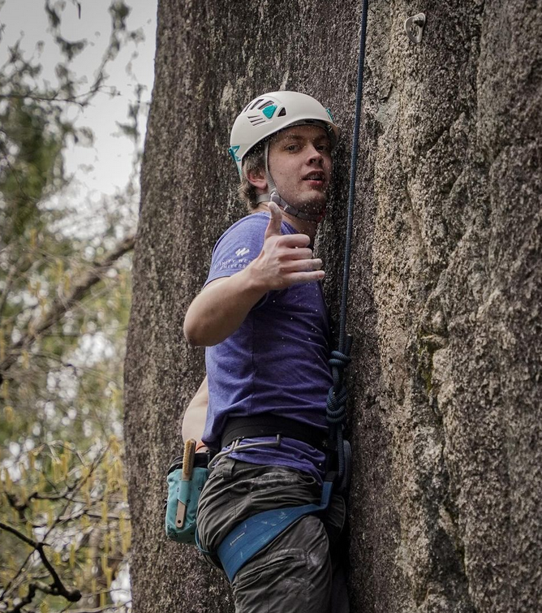

<link rel="stylesheet" type="text/css" href="assets/styles.css">

<nav>
  <ul>
    <li><a href="index.md">Home</a></li>
    <li>
      <a href="programming.md">Programming Projects</a>
      <ul>
        <li><a href="project1.html">Particle System</a></li>
        <li><a href="project2.html">Ray Tracer</a></li>
        <li><a href="project3.html">Learning Languages</a></li>
        <li><a href="project4.html">AI Maze-Solving Robot</a></li>
        <li><a href="project5.html">ESP32 Projects</a></li>
        <li><a href="project6.html">DIY Guitar Pedal</a></li>
        <li><a href="project7.html">Pinyata Rhythm Game</a></li>
        <li><a href="project8.html">VR Campus Tour</a></li>
        <li><a href="project9.html">Making a Spotify Record Player</a></li>
      </ul>
    </li>
    <li>
      <a href="audio-video.md">Video/Audio Projects</a>
      <ul>
        <li><a href="video1.html">Video 1</a></li>
        <li><a href="audio1.html">Audio 1</a></li>
        <!-- Add more projects as needed -->
      </ul>
    </li>
    <li><a href="resume.md">Resume</a></li>
  </ul>
</nav>

<h1>Welcome to My Portfolio</h1>

  

    
Hey! My name is Jonah Watts, and I have traveled the world and worked on a variety of projects in the fields of programming, audio, and video. I am passionate about creating and learning new things, and I am always looking for new opportunities to collaborate and grow.

    
    
I have grown up in Canada, France, Burundi, and I have a passion for storytelling, sustainability, and technology. I have finished my degree in Computer Science at Trinity Western University, and I am currently working on a variety of projects. Check them out below!

    <h2>Explore My Work</h2>
    <ul>
      <li><a href="programming.md">Programming Projects</a></li>
      <li><a href="audio-video.md">Video/Audio Projects</a></li>
      <li><a href="resume.md">Resume</a></li>
    </ul>
    
    
Feel free to explore my work and reach out if you'd like to collaborate or learn more about any projects!

  

  
  

    
  

